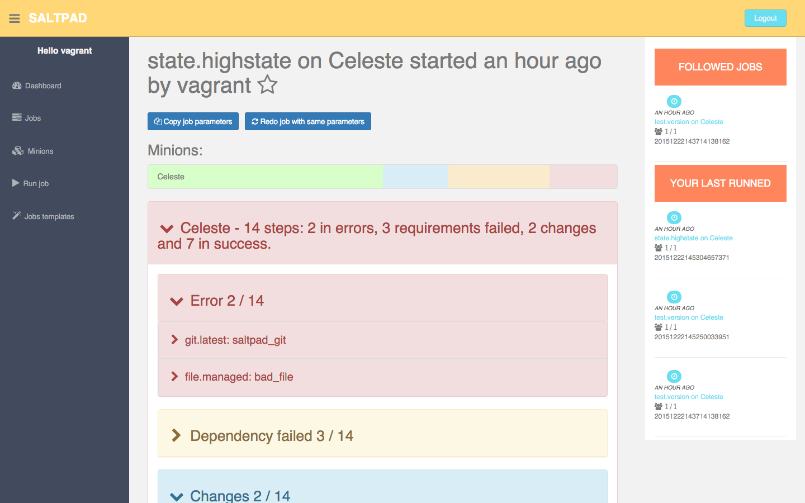

===============================
What is SaltPad?
===============================

SaltPad is a GUI tool to manage SaltStack deployments + orchestration. It's still very young and it should be considered as Alpha.

A walkthrough using screenshots is available in the screenshots directory (not up-to-date).

**This version of saltpad is a full-rewrite as a single app page. The old version in python is still available in the saltpad_v1 branch (https://github.com/tinyclues/saltpad/tree/saltpad_v1). If you cannot use this version, please open an issue to ease migration and see the Changelog (https://github.com/tinyclues/saltpad/blob/master/Changelog.md).**

SaltPad compatibility
=====================

SaltPad is mainly coded in Javascript and should be compatible with all modern browsers.

SaltPad communicate with Salt through the salt-api and thus requires access to the salt-api from the browser. If this is an issue, please drop a comment on [this issue](http://github.com/tinyclues/saltpad) to discuss the possible solutions. The salt-api format / specification is not yet stable, so SaltPad could only provide limited compatibility with salt-api. The salt-api format depends on 3 variables, salt version, the netapi used (cherrypy or tornado) and the master_job_cache used for storing and retrieving jobs results. SaltPad required some upgrade on salt-api side (for CORS support mainly) and will only work with a dev version

+--------------+---------------+------------------+------------+-----------------------------------+
| Salt Version | Netapi        | Master_job_cache | Supported? | Issue if not supported            |
+--------------+---------------+------------------+------------+-----------------------------------+
| 2015.8.dev   | rest_tornado  | * (all)          | YES        |                                   |
+--------------+---------------+------------------+------------+-----------------------------------+

Here is the list of issues about the salt-api format standardization that would make the saltpad job much much easier:

* https://github.com/saltstack/salt/issues/23131
* https://github.com/saltstack/salt/issues/19018
* https://github.com/saltstack/salt/issues/13698

Installation
============

You have several solutions to install saltpad, but before installing saltpad, you need to install and configure salt-api.

Install salt-api
----------------

The Web GUI uses the HTTP Api of SaltStack to interact with the Salt-Master. You should first install the Salt-Api on your Salt-Master. You can find the documentation in the `SaltStack documentation`_.

The Salt-Api project has been merged into SaltStack in release 2014.7.0, so you can use the salt-api with SaltStack 2014.7.0 release or install salt-api with previous releases, you can install it using pip:

.. code:: bash

    pip install salt-api

Or if you're using a Debian-derived linux:

.. code:: bash

    sudo apt-get install salt-api

The salt-api requires some configuration too. Salt-api supports multiple implementation, but the rest_tornado implementation is the more mature and the recommended one when using saltpad. If you want to run salt-api and saltpad on the same host, you can configuration salt-api as followed in the file /etc/salt/master:

.. code:: yaml

    rest_tornado:
      port: 5417
      host: 127.0.0.1
      disable_ssl: true
      websockets: True
      cors_origin: '*'

Warning, this configuration has ssl disabled and it only listens to localhost, if you want to expose the salt-api to the network, you should really deploy it behind nginx with ssl, do not change the host to 0.0.0.0 without proper ssl support as well!

With this salt-api configuration, the saltpad default configuration should work, if the salt-api and saltpad are not located on your device, you either could change the HOST settings in saltpad (but only for testing purposes, it will not use tls so all your data will be sent in clear text) or deploy it behind nginx with ssl configured.

Then you can launch the API using the following command:

.. code:: bash

    sudo /etc/init.d/salt-api restart

Or if you want to launch salt-api by hand.

.. code:: bash

    salt-api

Configure salt-api authentication
---------------------------------

You will also need to `configure the external auth`_ in your salt master. For example in master config:

.. code-block:: bash

  external_auth:
    pam:
      myusername:
          - .*
          - '@runner'
          - '@wheel'

Currently SaltPad requires exactly these permissions, for various reasons. There is ongoing improvements on SaltStack part and in Saltpad to require less permissions. Saltpad will not allow you to connect if you don't have this set of permissions and will show you an error message.

Check salt-api configuration
----------------------------

You can check you salt-api installation and configuration with this command on the salt-api host:

.. code-block:: bash

    curl -i -H accept=application/json -d username=USER -d password=PASSWORD -d eauth=pam http://localhost:5417/login

In case of successful login you should have the response body that looks like that:

.. code-block:: bash

    {"return": [{"perms": [".*", "@runner", "@wheel"], "start": 1431010274.426576, "token": "70604a26facfe2aa14038b9abf37b639c32902bd", "expire": 1431053474.426576, "user": "salt", "eauth": "pam"}]}

If the output includes "HTTP/1.1 401 Unauthorized", double-check the salt-api config in salt-master config file.

SaltPad Web GUI configuration
=============================

If you just want to test SaltPad, you can use the Vagrantfile provided in vagrant directory. Just follow README in the same repository and have fun!

Configure SaltPad
-----------------

If your checklist is done, you can now configure SaltPad.

Get into the saltpad directory, copy the file named "settings.json.sample" as "settings.json". You will need to edit it. Set your API_URL if your salt-master is not local and if your salt-api is served over SSL, set the SECURE_HTTP key to `true`. You can also configure job templates in this file, see the corresponding part for more details. You will need to strip all comments starting with '#' from the file.

Here is an example of a settings.json file:

.. code-block:: json

    {
        "API_URL": "localhost:5417",
        "SECURE_HTTP": false,
        "templates": {
            "basic": {
                "description": "Basic template",
                "matcher": "glob",
                "target": "*",
                "moduleFunction": "test.fib",
                "arguments": {
                    "num": 10
                }
            },

            "version": {
                "description": "Basic version",
                "matcher": "glob",
                "target": "Celeste",
                "moduleFunction": "test.version",
                "arguments": {}
            }
        }
    }

Job templates
-------------

Job templates are now defined in the configuration file directly instead of storing them in salt master configuration file. They are stored under the "templates" key and their format are the following:

.. code-block:: json

    "basic": { # Template name
        "description": "Basic template", # Template description
        "matcher": "glob", # Matcher, one of salt matcher (see salt --help, Target Options)
        "target": "*", # The target
        "moduleFunction": "test.fib", # Which function
        "arguments": { # The function arguments
            "num": 10
        }
    }

You can add as many templates as you want, but they need to have a distinct name.

Install saltpad for production
------------------------------

You can install a release version of saltpad on a web server with nginx or apache to serve it.

Releases versions are available on github (https://github.com/tinyclues/saltpad/releases). Download the distribution zip:

.. code-block:: bash

    wget https://github.com/tinyclues/saltpad/releases/0.1/dist.zip

Unzip it on your webserver where you want:

.. code-block:: bash

    cp dist.zip /opt/saltpad
    cd /opt/saltpad
    unzip dist.zip

You also need to create the file settings.json in the same directory, the filename will be /opt/saltpad/settings.json. You can use the file settings.json.sample as a base. Remember that you will need to strip all comments starting with '#' from the file.

Then point your favorite webserver on the directory. For example, for an unsecured (HTTP) saltpad install with nginx, the configuration will be:

.. code-block:: nginx

    server {
        listen 80 default_server;
        listen [::]:80 default_server ipv6only=on;

        root /opt/saltpad/;
        index index.html;

        server_name SALTPAD.YOURDNS;

        location / {
                try_files $uri /index.html;
        }
    }

Warning, this nginx configuration IS NOT SUITABLE for production, for configuring a ssl enabled site with nginx or apache, you can use the excellent `Mozilla SSL Configuration Generator`_. Configuring a website in a secure manner is a job by itself, please ask the more qualified person to do it.

You can put this configuration and replace the content of the file "/etc/nginx/sites-enabled/default" or ask your system administrator to configure Nginx or Apache.

Now reload the webserver:

.. code-block:: bash

    sudo /etc/init.d/nginx reload

And now, saltpad should be available on the web server, you can check with this command:

.. code-block:: bash

    curl http://localhost

The output should look like:

.. code-block::

    <!doctype html>
    <html lang="en" data-framework="react">
      <head>
        <meta charset="utf-8">
        <title>SaltPad</title>
      <link href="/styles.css" rel="stylesheet"></head>
      <body>
        

      </body>
    </html>

There is a beginning of deployment formula located here (https://github.com/tinyclues/saltpad/blob/saltpad_v2/vagrant/salt/roots/salt/saltpad.sls), I still try to make the cleanest integration possible with the nginx-formula (https://github.com/saltstack-formulas/nginx-formula).

Hack on saltpad
---------------

If you want to hack on saltpad and start the dev environment, go on the repository root and launch these commands:

.. code-block:: sh

    npm install # install javascript dependencies
    ./node_modules/bower/bin/bower install # install browser dependencies
    cp settings.json.sample settings.json

You can now launch the dev environment:

.. code-block:: sh

    npm start

SaltPad will be available on localhost:3333(localhost:3333).

Features
--------

* Get overview of all your minion.
* Get details about each minions, its Salt version.
* Easy launch of state.highstate jobs with or without dry-run mode.
* Manage minion keys.
* Launch jobs.
* Access jobs details easily.
* Save job configuration as templates and launch them with one click on a button.
* Quick debug minion, get all usefull information in one place.

.. _SaltStack documentation: http://docs.saltstack.com/en/latest/ref/netapi/all/salt.netapi.rest_cherrypy.html
.. _configure the external auth: http://docs.saltstack.com/en/latest/topics/eauth/index.html
.. _saltpad_v1 branch: https://github.com/tinyclues/saltpad/tree/saltpad_v1
.. _Mozilla SSL Configuration Generator: https://mozilla.github.io/server-side-tls/ssl-config-generator/
.. _Changelog: https://github.com/tinyclues/saltpad/Changelog.md

Known issues
------------

* When getting single job output, SaltStack renders it even if it's not necessary. This can cause severe slowdown and so slow the interface. It's a known issue in SaltStack (https://github.com/saltstack/salt/issues/18518) and it's should be solved in next release. If it's a problem, you can comment this line https://github.com/saltstack/salt/blob/v2014.7.0/salt/runners/jobs.py#L102 and this line https://github.com/saltstack/salt/blob/v2014.7.0/salt/runners/jobs.py#L81 in your salt master to speed up the job retrieval system.
